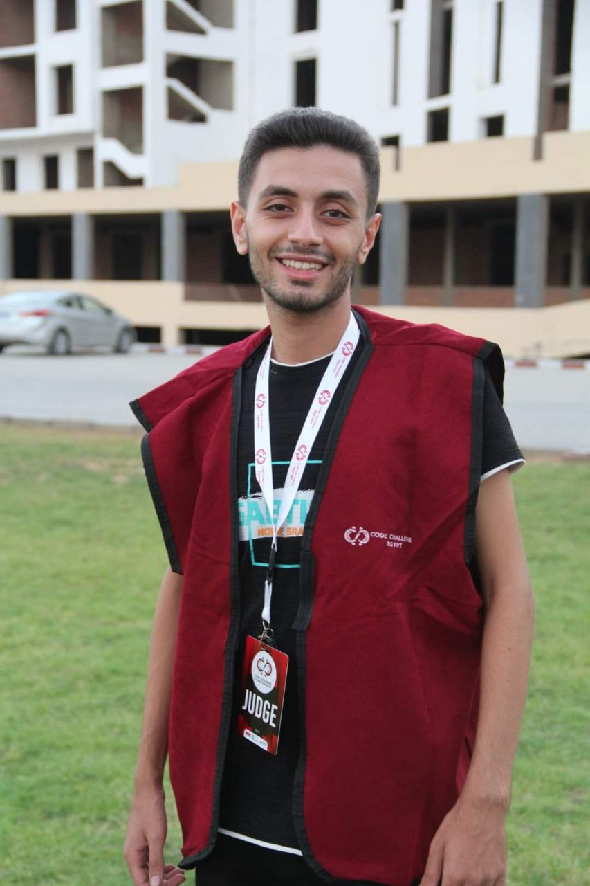

<!DOCTYPE html>
<html lang="en">
<head>
  <meta charset="UTF-8">
  <meta name="viewport" content="width=device-width, initial-scale=1.0">
  <title>Mario Magdy | Portfolio</title>
  
</head>
<body>

  <!-- Navbar -->
  <nav>
    <h2>Mario Magdy</h2>
    <ul>
      <li><a href="#about">About</a></li>
      <li><a href="#education">Education</a></li>
      <li><a href="#experience">Experience</a></li>
      <li><a href="#projects">Projects</a></li>
      <li><a href="#skills">Skills</a></li>
      <li><a href="#contact">Contact</a></li>
     <li><a href="CV_Mario Magdy.pdf">CV</a></li>
    </ul>
  </nav>

  <!-- Hero -->
  <section class="hero">
    
    

      <h1>Mario Magdy</h1>
      
Junior Full-Stack Developer | Communication Engineer

    

  </section>

  <!-- About -->
  

    <section id="about" class="fade-in">
      <h2>About Me</h2>
      

   I am a junior full-stack developer currently in the DEPI 6-month program. With a
background in communication engineering, I bring both technical and problem-solving skills. I
am also professional in creating impactful presentations with PowerPoint and Word.
I inspire clients by combining development expertise with clear communication, delivering
solutions that are both functional and easy to understand.
      

    </section>

    <!-- Education -->
    <section id="education" class="fade-in">
      <h2>Education</h2>
      <ul>
        <li>Electronics & Communication, Alexandria University (GPA: 3.8)</li>
        <li>Projects using MATLAB, VSCODE, MULTISIM, STK, DIALUX, AUTOCAD, ORCAD</li>
      </ul>
    </section>

    <!-- Experience -->
    <section id="experience" class="fade-in">
      <h2>Experience & Courses</h2>
      <ul>
        <li>Digital Egypt Pioneers Program (6/2025 - 12/2025)</li>
        <li>Oil Company Training (7/2024)</li>
        <li>Copper Company Training (8/2024)</li>
        <li>Maths & Algorithms Course for AI Competition (2/2024)  <a href="aiu.jfif"> certificate</a></li>
        <li>I judged a competition of robot challenge in coding (2025,2024)    <a href="1758565757428.jfif"> certificate</a></li>
    
        <li>Third place in a competition of international robot Challenge in sumo mega as a coach (2024)  <a href="sumo.jfif"> certificate</a></li>
        <li>Participated in Global Robotics Challenge in coding and won best performance award (2024) <a href="grc.jfif">certificate </a></li></li>
        <li>First place in a competition of robot challenge in web development in the republic as a coach (2023) <a href="web1.jfif"> certificate</a></li></li>
      </ul>
    </section>

    <!-- Projects -->
    <section id="projects" class="fade-in">
      <h2>Projects</h2>
      

        

          <h3>Website</h3>
          
this is a website using html and css

          <a href="web.html">View Details</a>
        

        

          <h3>lollipop</h3>
          
this is a drawing using html and css

          <a href="lollipop.html">View Details</a>
        

        

          <h3>Watch</h3>
          
this is a drawing using html and css

          <a href="watch.html">View Details</a>
        

      

    </section>

    <!-- Skills -->
    <section id="skills" class="fade-in">
      <h2>Skills</h2>
      

        
HTML

        
CSS

        
JavaScript

        
Python

        
SQL

        
C / C#

        
Matlab

        
AutoCAD

        
Problem Solving

        
Soft Skills

      

    </section>

    <!-- Contact -->
    <section id="contact" class="contact fade-in">
      <h2>Contact Me</h2>
      
Email: <a href="mailto:mariomagdy887@gmail.com">mariomagdy887@gmail.com</a>

      
Phone: <a href="#">01228469938</a>

      
linkedin: <a href="https://www.linkedin.com/in/mario-magdy-6063082b8?utm_source=share&utm_campaign=share_via&utm_content=profile&utm_medium=android_app">Mario Magdy</a>

    </section>
  

  <!-- JS -->
  
</body>
</html>
